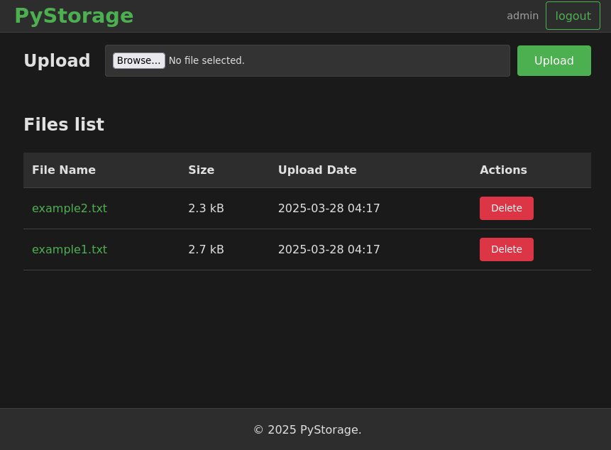

# PyStorage

Pretty simple selfhosted file storage solution with web interface and REST API.
Perfect for home use and small teams.



## Features

- User authentication
- File upload via web interface or API
- Isolated storage per user
- Docker support
- 90%+ test coverage
- REST API for integration
- Easy deployment

## Quick Start

### Installation

- Clone repository:

```sh
git clone https://github.com/yourusername/pystorage.git
cd pystorage
```

### Configuration

- Copy config template:

```
cp example.config.py config.py
```

- Configure settings in `config.py`:

```
class Config:
    SECRET_KEY = 'your-secret-key'  # Generate with: openssl rand -hex 32
    USERS = {
        'admin': 'pbkdf2:sha256...',  # Use generate_password_hash
    }
```

  -  Password generation:

```
python -c "from werkzeug.security import generate_password_hash; print(generate_password_hash('my_strong_password'))"
```

### Runing

- With `gunicorn`:

  - Create a virtualenv and install dependencies:

  ```sh
python3 -m venv .venv
source venv/bin/activate
pip install --upgrade pip
pip install -r requirements.txt
  ```

  - Start app:

  ```sh
gunicorn --workers 4 --bind 0.0.0.0:5000 wsgi-app:app
  ```

- With `docker`:

```sh
docker-compose up -d
```

## Usage

### Web Interface:

- Open http://localhost:5000
- Login with your credentials
- Upload and manage files through intuitive interface

### API

You can also use it with CLI utils like curl.

#### Base URL

http://localhost:5000/api/


#### Endpoints

| Method | Path           | Description   |
| ------ | ------------- | ------------- |
| GET    | /files         | List files    |
| POST   | /upload        | Upload file   |
| GET    | /download/:id | Download file |
| DELETE | /delete/:id   | Delete file   |

#### Example Request:

```sh
# Upload file
curl -u user:pass -F "file=@data.txt" http://localhost:5000/api/upload

# List files
curl -u user:pass http://localhost:5000/api/files
```

#### Example Response:

```json
{
  "files": [
    {
      "name": "report.pdf",
      "size": 24576,
      "url": "http://localhost:5000/api/download/report.pdf"
    }
  ]
}
```

## Testing

Run with coverage report:

```sh
pytest
```

## License

MIT License - see [LICENSE](LICENSE) for details
